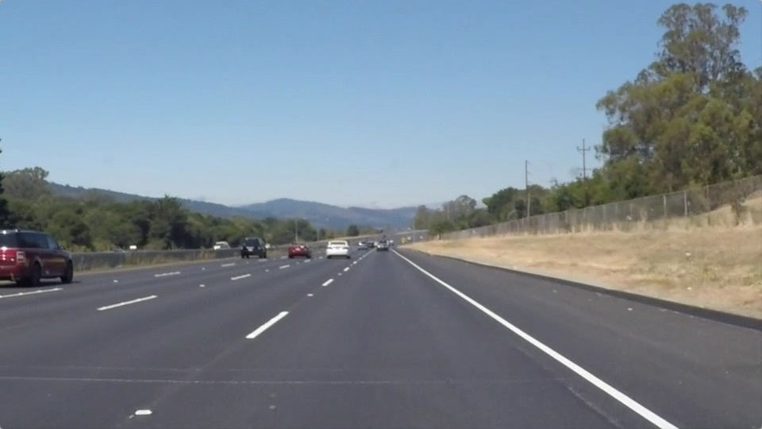
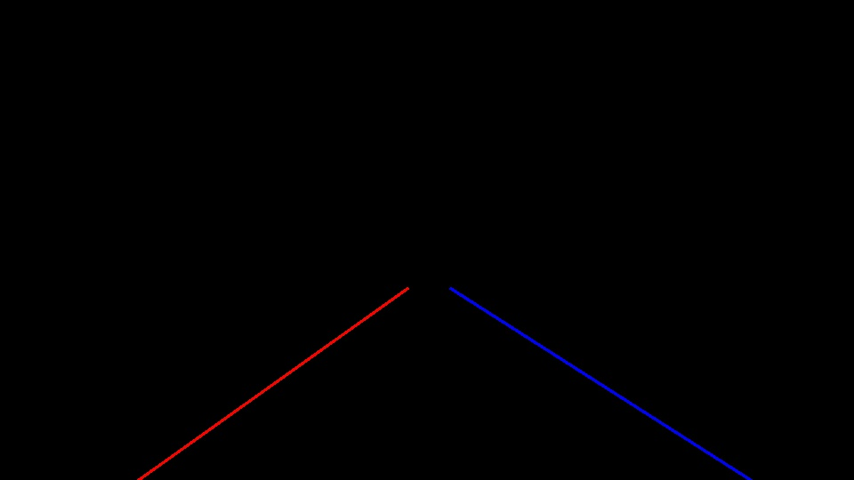

# **Finding Lane Lines on the Road** 


---
## Overview
The goals / steps of this project are the following:
* Make a pipeline that finds lane lines on the road

---

## Quickstart
To view the project in an interactive jupyter notebook, run:

```bash
jupyter notebook P1.ipynb
```

However, the code has been written in more organized python modules, meaning you can run locally like so:
```bash
python main.py
```
The following flags are available:

| Flag | Function | Default |
|:----:|-------|:----:|
| `input_image_dir` | Where the program will look for input images.   | `./test_images/`|
| `input_video_dir` | Where the program will look for input videos.   | `./test_videos/`|
| `output_image_dir` | Where the program will write output images.   | `./test_images_output/`|
| `output_video_dir` | Where the program will write output videos.   | `./test_video_output/`|

For example:
```bash
python main.py --output_image_dir=./dir_name_here/
```

---
## Source Overview
- `main.py`: the main lane detection pipeline and entry point to the application
- `utils.py`: various utility and helper methods related to image processing and lane detection
- `elementary_line_segment.py`: class and helper methods related to elementary line segments
- `P1.ipynb`: a jupyter notebook containing similar code as the above files

---
## Lane Detection Pipeline:
> **Note:** For more detail, see the code which is heavily commented/documented.

1. Convert image to grayscale
2. Blur image with Gaussian smoothing

Original | Grayscale | Blur
:-------------------------:|:-------------------------:|:-------------------------:
 |  | 

3. `Detect edges` using Canny edge detection
4. Only keep the edges that were originally `white or yellow`  (use an image mask created from only the yellow and white portions of the original input image)
5. Mask everything but the `region of interest`

Canny Edges | White and Yellow Mask | Region of Interest
:-------------------------:|:-------------------------:|:-------------------------:
 |  | 

6. `Detect candidate line segments` in the masked edges using Hough transform
8. `Remove unlikely candidates` (based on magnitude of the slope each candidate line segment)
9. Group collinear segments (cluster the candidates using `k-means clustering` based on the polar form of each segment, k=2)
10. `Average the line segments` in each of the 2 clusters
11. Label the 2 averaged cluster representations as `left` and `right` based on the sign of the average slope in the cluster
12. Overlay the `left` and `right` averaged segments onto the image.
    
Detected Lines | Overlay
:-------------------------:|:-------------------------:
 | 


---
## Potential Shortcomings:
- Pipeline is not invariant to transformations (ie: assumes a certain region of interest and camera orientation wrt. lanes)
- Clustering technique naively assumes all invalid candidates have been pruned
- Clustering technique naively assumes the 2 clusters represent left and right lane lines... even if 2 clusters are formed among the segments from one side only (this occurs if there are no candidates on one side)

---
## Possible Improvements:
- More parameter tuning
- Explore other collinearity metrics
- Improve merging technique
- Keep a running average across multiple video frames to ignore outliers
