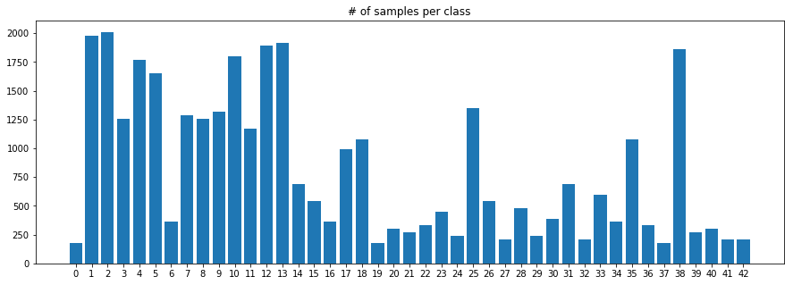
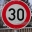
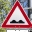
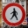
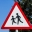
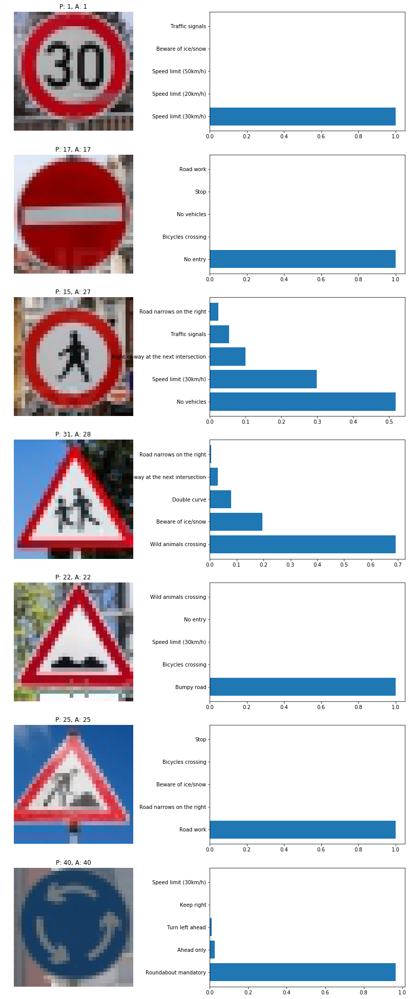

# **Traffic Sign Recognition** 

## Overview

The goals / steps of this project are the following:
* Load the data set (see below for links to the project data set)
* Explore, summarize and visualize the data set
* Design, train and test a model architecture
* Use the model to make predictions on new images
* Analyze the softmax probabilities of the new images
* Summarize the results with a written report

---

## Source Code.

Code available here: [project code](https://github.com/dcyoung/self-driving-car-ND-projects.P2-TrafficSignClassifier/Traffic_Sign_Classifier.ipynb)

## Data Set Summary & Exploration

I used numpy to calculate summary statistics of the traffic signs datasets:

* The size of training set is 34799
* The size of the validation set is 4410
* The size of test set is 12630
* The shape of a traffic sign image is (32,32,3)
* The number of unique classes/labels in the data set is 43

#### Visualization of the dataset.

Here is an exploratory visualization of the training data set. It is a bar chart showing the distribution of training samples by class. Ideally, we'd have a balanced distribution with a similar number of examples for each class. Some classes in this dataset have almost an order of magnitude fewer samples than other classes.



See the jupyter notebook output for additional visualizations.

## Preprocessing image data

First I converted all datasets to normalized floats like so:
- Convert 8-bit images to float32
- Normalized all pixel values to be between [-1:1]

Then I created 2 data generators capable of producing samples for either training or prediction. These generators produce "centered" samples which helps each feature have a similar range to avoid exploding gradients. Both generators were fit on the training dataset such that they could pre-process a new sample like so:
- Set input mean to 0 over the dataset, feature-wise (pixel-wise)
- Divide inputs by std of the dataset, feature-wise (pixel-wise)

Additionally, the data generator for producing training samples included the following data augmentation:
- randomly shift images horizontally or vertically by up to 10%
- randomly rotate images by up to 10 degrees

These small data augmentation techniques help to avoid overfitting by keeping the model from seeing the same image too many times.

## Design + Testing a Model Architecture

#### Final model architecture

I implemented a model adapted from [this paper](https://arxiv.org/abs/1412.6806#) called the `AllConvNet`. As the name suggests, it only uses convolutional layers, and varies the stride to effectively perform pooling. I also used batch normalization layers to avoid overfitting.

It was defined in this fashion:
```python
model = Sequential()

model.add(Conv2D(96, (3, 3), padding='same', activation='relu', input_shape=(32, 32, 3)))
model.add(Conv2D(96, (3, 3), padding='same', activation='relu'))
model.add(Conv2D(96, (3, 3), padding='same', strides=(2,2)))
#model.add(Dropout(0.5))
model.add(BatchNormalization())

model.add(Conv2D(192, (3, 3), padding='same', activation='relu'))
model.add(Conv2D(192, (3, 3), padding='same', activation='relu'))
model.add(Conv2D(192, (3, 3), padding='same', strides=(2,2)))
#model.add(Dropout(0.5))
model.add(BatchNormalization())

model.add(Conv2D(192, (3, 3), padding='same', activation='relu'))
model.add(Conv2D(192, (1, 1), padding='valid', activation='relu'))
model.add(Conv2D(num_classes, (1, 1), padding='valid'))

model.add(GlobalAveragePooling2D())
model.add(Activation('softmax'))
```
A summary of the layers is as follows:
```
_________________________________________________________________
Layer (type)                 Output Shape              Param #   
=================================================================
conv2d_1 (Conv2D)            (None, 32, 32, 96)        2688      
_________________________________________________________________
conv2d_2 (Conv2D)            (None, 32, 32, 96)        83040     
_________________________________________________________________
conv2d_3 (Conv2D)            (None, 16, 16, 96)        83040     
_________________________________________________________________
batch_normalization_1 (Batch (None, 16, 16, 96)        384       
_________________________________________________________________
conv2d_4 (Conv2D)            (None, 16, 16, 192)       166080    
_________________________________________________________________
conv2d_5 (Conv2D)            (None, 16, 16, 192)       331968    
_________________________________________________________________
conv2d_6 (Conv2D)            (None, 8, 8, 192)         331968    
_________________________________________________________________
batch_normalization_2 (Batch (None, 8, 8, 192)         768       
_________________________________________________________________
conv2d_7 (Conv2D)            (None, 8, 8, 192)         331968    
_________________________________________________________________
conv2d_8 (Conv2D)            (None, 8, 8, 192)         37056     
_________________________________________________________________
conv2d_9 (Conv2D)            (None, 8, 8, 43)          8299      
_________________________________________________________________
global_average_pooling2d_1 ( (None, 43)                0         
_________________________________________________________________
activation_1 (Activation)    (None, 43)                0         
=================================================================
Total params: 1,377,259
Trainable params: 1,376,683
Non-trainable params: 576
_________________________________________________________________
```


#### Model Training

To train the model, I used...
- ADAM optimizer as it tends to be less erratic than standard SGD and requires less fiddling with the learning rate
- batch size of 32 to stay within my GPU memory
- epoch size that included two passes through the dataset (but with augmentation... so no exact image seen twice)
- 8 epochs

#### Prototyping Approach


I implemented the `AllConvNet` because it was interesting, and I wanted to try it. It's overkill for this project, and a shallower net would have trained faster, and avoided overfitting the tiny training dataset. The network handily passed a validation accuracy of 0.93 the first try, but was clearly overfitting. So I implemented the data augmentation described above to increase the diversity of the training dataset.

I started with dropout to avoid overfitting, but switched to batch normalization after a little bit of experimentation... but my minimal testing between the two did not show a dramatic difference. 

Plotting the training history (training + validation accuracy) shows that the model was steadily improving on both datasets. The accuracy on the test set was similar to that of the validation set... indicating the network generalized well to both, rather than getting lucky with the validation set.

#### Results 
My final model results were:
* training set accuracy of 0.995
* validation set accuracy of 0.984
* test set accuracy of 0.980

## Testing Model on New Images

#### Five new German traffic signs found on the web

Here are five German traffic signs that I found on the web:

      

In general, I suspect that circular signs be easy to identify as the shape is invariant to rotation. However, this also means they may be easier to misclassify amongst other circular signs. Additionally, more complex sign content could be difficult to classify as the intricate features appear blurry and lose definition in low resolution images.  For example, the two pedestrians might be difficult to classify, especially since that class had relatively few training examples.

The following image shows 2 things. First, the title above each sign shows the predicted class (`P`) and the actual class (`A`). Second, the bar charts next to each sign represent the top 5 softmax probabilities produced by the network for that sample. ie: the 5 most likely labels from the 43 classes, as predicted by the network...



The network accurately predicted labels for only 5 of the 7 new images... an accuracy of ~71.4%. This is significantly less than the accuracy from the test set, but with such a small sample size (7) it is hard to compare. 

For the most part, the network is 100% confident in the accurate predictions. However, the 2 inaccurate predictions, both of which involve pedestrians, have mixed predicted distributions. Normally this is a good sign for misclassifications, as we'd prefer to see the network be confused rather than confidently innacurate. However, the actual classes don't even appear in the top 5 predicted.

While I am surprised the pedestrian classes are not included in the top 5 softmax probabilities for the incorrect predictions, most of the top 5 classes are reasonable misclassifications. For example, the shape and border of the sign is typically the same in both the predicted and actual class (such as `wild animal crossing` and `children crossing`). Additionally, the content can be rather similar... like how the double curve looks like 2 pedestrians.

